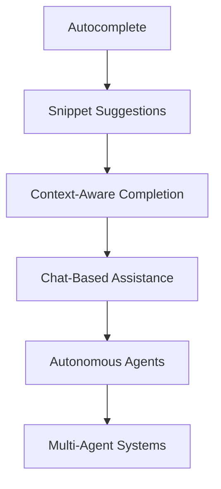

# Getting Started with Coding Agents using GitHub Copilot

A Technical Deep Dive into AI-Powered Development

<div class="pt-12">
  <span @click="$slidev.nav.next" class="px-2 py-1 rounded cursor-pointer" hover="bg-white bg-opacity-10">
    Press Space to continue <carbon:arrow-right class="inline"/>
  </span>
</div>

<div class="abs-br m-6 flex gap-2">
  <a href="https://github.com/aeff60/agentcon-bkk-2026-coding-agents" target="_blank" alt="GitHub"
    class="text-xl slidev-icon-btn opacity-50 !border-none !hover:text-white">
    <carbon-logo-github />
  </a>
</div>

---
layout: default
---

# Agenda

<v-clicks>

- 🤖 **What are Coding Agents?** - Understanding AI-powered development assistants
- 🎯 **GitHub Copilot Overview** - Features and capabilities
- 🛠️ **Getting Started** - Setup and configuration
- 💡 **Core Features** - Code completion, chat, and more
- 🔧 **Advanced Usage** - Slash commands and context
- 🚀 **Best Practices** - Writing effective prompts
- 📊 **Real-World Examples** - Practical use cases
- 🔒 **Security & Privacy** - Keeping your code safe
- 🎓 **Learning Strategies** - Maximizing productivity
- 🔮 **Future of Coding Agents** - What's next?
- 📝 **Q&A** - Your questions answered

</v-clicks>

---
layout: two-cols
---

# What are Coding Agents?

AI-powered assistants that understand and generate code

<v-clicks>

### Key Characteristics

- 🧠 **Context-Aware** - Understands your codebase
- 💬 **Conversational** - Natural language interaction
- 🎯 **Task-Focused** - Completes specific coding tasks
- 🔄 **Iterative** - Learns from feedback
- 🛡️ **Safe** - Built with security in mind

</v-clicks>

::right::

<v-clicks>

### Evolution of AI Assistants



<div class="mt-4 text-sm opacity-75">
We're currently in the Agent era
</div>

</v-clicks>

---
layout: default
---

# GitHub Copilot Overview

Your AI pair programmer powered by OpenAI Codex

<div class="grid grid-cols-2 gap-4 mt-8">

<v-clicks>

<div class="p-4 rounded bg-gray-800">

### 🎯 Code Completion
Real-time suggestions as you type
- Function implementations
- Test cases
- Documentation
- Comments

</div>

<div class="p-4 rounded bg-gray-800">

### 💬 Copilot Chat
Interactive conversations about code
- Explain complex code
- Debug issues
- Refactor suggestions
- Architecture guidance

</div>

<div class="p-4 rounded bg-gray-800">

### 🔧 Slash Commands
Quick, powerful commands
- `/explain` - Code explanation
- `/fix` - Bug fixes
- `/tests` - Generate tests
- `/doc` - Documentation

</div>

<div class="p-4 rounded bg-gray-800">

### 🎨 Workspace Context
Full repository awareness
- Multi-file understanding
- Project patterns
- Dependency awareness
- Architecture comprehension

</div>

</v-clicks>

</div>

---
layout: default
---

# Getting Started with GitHub Copilot

Quick setup guide for immediate productivity

<v-clicks>

### Prerequisites

```bash
# 1. Install VS Code or compatible IDE
# 2. Install GitHub Copilot extension
# 3. Sign in with GitHub account (requires subscription)
```

### Installation Steps

1. **Install Extension**
   - Open VS Code Extensions (⇧⌘X)
   - Search for "GitHub Copilot"
   - Click Install

2. **Authenticate**
   - Sign in with GitHub
   - Authorize the extension
   - Verify subscription status

3. **Start Coding**
   - Open any file
   - Start typing - suggestions appear automatically
   - Press `Tab` to accept, `Esc` to dismiss

</v-clicks>

---
layout: default
---

# Code Completion in Action

Real-time suggestions as you code

````md magic-move {lines: true}
```python
# Start typing a function signature
def calculate_fibonacci
```

```python
# Copilot suggests the implementation
def calculate_fibonacci(n: int) -> int:
    """Calculate the nth Fibonacci number."""
    if n <= 1:
        return n
    return calculate_fibonacci(n - 1) + calculate_fibonacci(n - 2)
```

```python
# You can accept and then get test suggestions
def calculate_fibonacci(n: int) -> int:
    """Calculate the nth Fibonacci number."""
    if n <= 1:
        return n
    return calculate_fibonacci(n - 1) + calculate_fibonacci(n - 2)

def test_calculate_fibonacci():
    assert calculate_fibonacci(0) == 0
    assert calculate_fibonacci(1) == 1
    assert calculate_fibonacci(10) == 55
```
````

<div v-click class="mt-4 p-4 rounded bg-blue-900 bg-opacity-30 border border-blue-500">
💡 <strong>Pro Tip:</strong> Write clear function names and comments to get better suggestions
</div>

---
layout: default
---

# Copilot Chat: Your AI Pair Programmer

Natural language conversations about your code

<div class="grid grid-cols-2 gap-4 mt-4">

<div>

### Example Conversations

<v-clicks>

**You:** "Explain this regex pattern"
```javascript
/^[\w-\.]+@([\w-]+\.)+[\w-]{2,4}$/
```

**Copilot:** This regex validates email addresses:
- `^[\w-\.]+` - Username with letters, numbers, dots
- `@` - Literal @ symbol
- `([\w-]+\.)+` - Domain parts with dots
- `[\w-]{2,4}$` - TLD (2-4 characters)

</v-clicks>

</div>

<div>

### Common Use Cases

<v-clicks>

- 🐛 **Debugging** - "Why isn't this working?"
- 📚 **Learning** - "How does async/await work?"
- ♻️ **Refactoring** - "Make this more efficient"
- 🧪 **Testing** - "Generate unit tests for this"
- 📖 **Documentation** - "Add JSDoc comments"
- 🏗️ **Architecture** - "Design a user service"

</v-clicks>

</div>

</div>

---
layout: default
---

# Advanced: Slash Commands

Powerful shortcuts for common tasks

<div class="grid grid-cols-2 gap-4 mt-6">

<v-clicks>

```markdown
/explain
```
<div class="text-sm opacity-75 mb-4">
Explains selected code in plain language
</div>

```markdown
/fix
```
<div class="text-sm opacity-75 mb-4">
Suggests fixes for bugs or errors
</div>

```markdown
/tests
```
<div class="text-sm opacity-75 mb-4">
Generates unit tests for your code
</div>

```markdown
/doc
```
<div class="text-sm opacity-75 mb-4">
Adds documentation comments
</div>

```markdown
/optimize
```
<div class="text-sm opacity-75 mb-4">
Suggests performance improvements
</div>

```markdown
/simplify
```
<div class="text-sm opacity-75 mb-4">
Refactors code for readability
</div>

</v-clicks>

</div>

---
layout: default
---

# Context is Everything

Helping Copilot understand your code better

<v-clicks>

### 1. Open Relevant Files
```bash
# Copilot analyzes open tabs for context
src/
  ├── models/user.ts      # ✅ Open
  ├── services/auth.ts    # ✅ Open
  └── utils/validate.ts   # ✅ Open
```

### 2. Reference Symbols with @
```markdown
# In Copilot Chat
"How does @UserService handle authentication?"
"Add logging to @calculatePrice function"
```

### 3. Use Descriptive Names
```typescript
// ❌ Poor context
function calc(a, b) { ... }

// ✅ Good context
function calculateMonthlyRevenue(sales: Sale[], expenses: Expense[]) { ... }
```

</v-clicks>

---
layout: default
---

# Best Practices for Effective Prompts

Get better results with clear communication

<div class="grid grid-cols-2 gap-6 mt-4">

<div>

### ✅ Do's

<v-clicks>

- **Be Specific**
  ```
  "Create a REST API endpoint for user login 
  with JWT authentication"
  ```

- **Provide Context**
  ```
  "Using Express.js and TypeScript, 
  create a middleware for rate limiting"
  ```

- **Show Examples**
  ```
  "Follow this pattern:
  async function getUser(id: string) {...}"
  ```

</v-clicks>

</div>

<div>

### ❌ Don'ts

<v-clicks>

- **Too Vague**
  ```
  "Make a login thing"
  ```

- **No Context**
  ```
  "Add authentication"
  ```

- **Conflicting Requirements**
  ```
  "Make it simple but also handle 
  all edge cases perfectly"
  ```

</v-clicks>

</div>

</div>

<div v-click class="mt-6 p-4 rounded bg-yellow-900 bg-opacity-30 border border-yellow-500">
⚡ <strong>Remember:</strong> Copilot is a tool, not a replacement for understanding code
</div>

---
layout: default
---

# Real-World Example: Building a REST API

Watch Copilot build an API endpoint step by step

<v-clicks>

### Step 1: Define the interface
```typescript
interface User {
  id: string;
  email: string;
  name: string;
  createdAt: Date;
}
```

### Step 2: Create the handler
```typescript
// Copilot suggests the full implementation
app.post('/api/users', async (req: Request, res: Response) => {
  const { email, name } = req.body;
  const user: User = {
    id: uuidv4(),
    email,
    name,
    createdAt: new Date()
  };
  await db.collection('users').insertOne(user);
  res.status(201).json(user);
});
```

</v-clicks>

---
layout: default
---

# Security & Privacy Considerations

Keeping your code safe while using AI

<div class="grid grid-cols-2 gap-4 mt-4">

<v-clicks>

<div class="p-4 rounded bg-red-900 bg-opacity-20 border border-red-500">

### 🔒 What to Watch For

- **Secrets in Code**
  - Don't commit API keys
  - Use environment variables
  - Review suggestions carefully

- **Sensitive Data**
  - Customer information
  - Internal business logic
  - Proprietary algorithms

- **License Compliance**
  - Review generated code
  - Check for copyrighted patterns
  - Understand usage rights

</div>

<div class="p-4 rounded bg-green-900 bg-opacity-20 border border-green-500">

### ✅ Best Practices

- **Use GitHub Copilot for Business**
  - No training on your code
  - Enhanced privacy controls
  - Admin oversight

- **Review All Suggestions**
  - Don't blindly accept
  - Understand the code
  - Test thoroughly

- **Configure Properly**
  - Set content exclusions
  - Use .copilotignore
  - Enable audit logs

</div>

</v-clicks>

</div>

---
layout: default
---

# Maximizing Your Productivity

Strategies for getting the most from Copilot

<v-clicks>

### 1. Start with Comments
```javascript
// Function to validate email format and check if domain exists
// Returns true if valid, false otherwise
// Throws error if DNS lookup fails
function validateEmail(email: string): Promise<boolean>
```

### 2. Use Test-Driven Development
```typescript
// Write tests first, let Copilot implement
describe('UserService', () => {
  it('should create a new user with hashed password', async () => {
    const user = await userService.create('test@example.com', 'password123');
    expect(user.password).not.toBe('password123');
  });
});
```

### 3. Iterate and Refine
- Accept suggestion → Review → Refine → Repeat
- Use chat to explain what you want differently
- Learn from the patterns Copilot suggests

</v-clicks>

---
layout: default
---

# The Future of Coding Agents

What's coming next in AI-assisted development

<v-clicks>

### Emerging Trends

<div class="grid grid-cols-3 gap-4 mt-4">

<div class="p-4 rounded bg-purple-900 bg-opacity-30">

**🤖 Autonomous Agents**
- Self-directed coding
- Multi-step task completion
- Proactive bug fixes

</div>

<div class="p-4 rounded bg-blue-900 bg-opacity-30">

**🔗 Multi-Agent Systems**
- Specialized agents
- Collaborative workflows
- Domain expertise

</div>

<div class="p-4 rounded bg-green-900 bg-opacity-30">

**🧠 Deeper Understanding**
- Full project context
- Architecture awareness
- Business logic comprehension

</div>

</div>

### The Developer's Role is Evolving

- From **writing code** → to **directing code**
- From **fixing bugs** → to **reviewing solutions**
- From **learning syntax** → to **designing systems**

</v-clicks>

<div v-click class="mt-6 text-center text-xl opacity-75">
🚀 The future is collaborative: Human creativity + AI efficiency
</div>

---
layout: center
class: text-center
---

# Questions & Discussion

Let's explore coding agents together

<div class="mt-8 grid grid-cols-3 gap-8 items-center justify-center">

<div>
  <carbon-chat class="text-6xl mb-2 mx-auto" />
  <div>Ask Questions</div>
</div>

<div>
  <carbon-code class="text-6xl mb-2 mx-auto" />
  <div>Share Experiences</div>
</div>

<div>
  <carbon-collaborate class="text-6xl mb-2 mx-auto" />
  <div>Collaborate</div>
</div>

</div>

<div class="mt-12">
  <a href="https://github.com/aeff60/agentcon-bkk-2026-coding-agents" 
     class="text-blue-400 hover:text-blue-300">
    github.com/aeff60/agentcon-bkk-2026-coding-agents
  </a>
</div>

---
layout: end
---

# Thank You!

Start your journey with coding agents today

<div class="abs-br m-6 text-xl">
  <carbon-logo-github /> AgentCon BKK 2026
</div>
