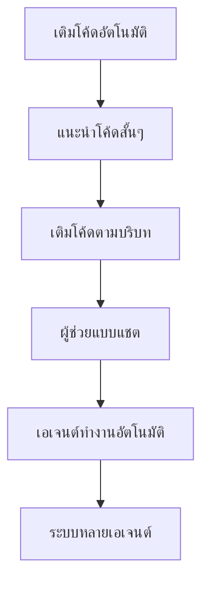

# Getting Started with Coding Agents using GitHub Copilot

<div class="pt-12">
  <span @click="$slidev.nav.next" class="px-2 py-1 rounded cursor-pointer" hover="bg-white bg-opacity-10">
    กด Space เพื่อไปต่อ <carbon:arrow-right class="inline"/>
  </span>
</div>

<div class="abs-br m-6 flex gap-2">
  <a href="https://github.com/aeff60/agentcon-bkk-2026-coding-agents" target="_blank" alt="GitHub"
    class="text-xl slidev-icon-btn opacity-50 !border-none !hover:text-white">
    <carbon-logo-github />
  </a>
</div>

---
layout: default
---

# หัวข้อวันนี้

<v-clicks>

- 🤖 **Coding Agents คืออะไร?** - เข้าใจผู้ช่วยเขียนโค้ดด้วย AI
- 🎯 **ภาพรวม GitHub Copilot** - ความสามารถหลักที่ควรรู้
- 🛠️ **เริ่มต้นใช้งาน** - ติดตั้งและตั้งค่าให้พร้อม
- 💡 **ฟีเจอร์สำคัญ** - แนะนำโค้ด, แชต, และอีกมากมาย
- 🔧 **การใช้งานขั้นสูง** - Slash commands และการใส่บริบท
- 🚀 **แนวทางที่ควรทำ** - เขียนพรอมป์ให้ได้ผลลัพธ์ดี
- 📊 **ตัวอย่างจริง** - เคสใช้งานที่ทำได้ทันที
- 🔒 **ความปลอดภัยและความเป็นส่วนตัว** - ใช้อย่างมั่นใจ
- 🎓 **กลยุทธ์การเรียนรู้** - เพิ่มประสิทธิภาพการทำงาน
- 🔮 **อนาคตของ Coding Agents** - กำลังไปทางไหน
- 📝 **Q&A** - ถาม-ตอบท้ายเซสชัน

</v-clicks>

---
layout: two-cols
---

# Coding Agents คืออะไร?

ผู้ช่วย AI ที่เข้าใจโค้ดและช่วยสร้างโค้ดให้เรา

<v-clicks>

### คุณสมบัติหลัก

- 🧠 **เข้าใจบริบท (Context-Aware)** - มองภาพรวมโปรเจกต์ได้
- 💬 **คุยได้แบบธรรมชาติ (Conversational)** - ใช้ภาษาคนได้
- 🎯 **โฟกัสงาน (Task-Focused)** - ทำงานเฉพาะจุดได้ดี
- 🔄 **ปรับตามฟีดแบ็ก (Iterative)** - แก้และปรับได้เป็นรอบ
- 🛡️ **คำนึงถึงความปลอดภัย (Safe)** - ออกแบบมาให้ใช้งานอย่างปลอดภัย

</v-clicks>

::right::

<v-clicks>

### Evolution of AI Assistants



<div class="mt-4 text-sm opacity-75">
ตอนนี้เราอยู่ในยุคของ Agent
</div>

</v-clicks>

---
layout: default
---

# ภาพรวม GitHub Copilot

ผู้ช่วยเขียนโค้ดคู่ใจที่ขับเคลื่อนด้วย OpenAI Codex

<div class="grid grid-cols-2 gap-4 mt-8">

<v-clicks>

<div class="p-4 rounded bg-gray-800">

### 🎯 Code Completion
แนะนำโค้ดแบบเรียลไทม์ขณะพิมพ์
- โครงฟังก์ชันพร้อมใช้งาน
- ตัวอย่างเทสต์
- เอกสารประกอบโค้ด
- คอมเมนต์อธิบาย

</div>

<div class="p-4 rounded bg-gray-800">

### 💬 Copilot Chat
พูดคุยกับ AI เกี่ยวกับโค้ดได้ทันที
- อธิบายโค้ดที่ซับซ้อน
- ช่วยไล่บั๊ก
- แนะนำการรีแฟกเตอร์
- ช่วยคิดโครงสร้างระบบ

</div>

<div class="p-4 rounded bg-gray-800">

### 🔧 Slash Commands
คำสั่งลัดที่ใช้งานเร็วและตรงจุด
- `/explain` - อธิบายโค้ด
- `/fix` - เสนอแนวทางแก้บั๊ก
- `/tests` - สร้างเทสต์
- `/doc` - สร้างเอกสารประกอบ

</div>

<div class="p-4 rounded bg-gray-800">

### 🎨 Workspace Context
เข้าใจบริบททั้งโปรเจกต์
- มองข้ามหลายไฟล์ได้
- เรียนรู้แพตเทิร์นของทีม
- เข้าใจ dependency
- เห็นภาพสถาปัตยกรรมโดยรวม

</div>

</v-clicks>

</div>

---
layout: default
---

# เริ่มต้นใช้งาน GitHub Copilot

ตั้งค่าไม่ยาก พร้อมใช้งานได้ทันที

<v-clicks>

### สิ่งที่ต้องมี

```bash
# 1. ติดตั้ง VS Code หรือ IDE ที่รองรับ
# 2. ติดตั้งส่วนขยาย GitHub Copilot
# 3. ล็อกอินด้วยบัญชี GitHub (ต้องมีสิทธิ์ใช้งาน)
```

### ขั้นตอนติดตั้ง

1. **ติดตั้งส่วนขยาย**
  - เปิดหน้า Extensions ใน VS Code (⇧⌘X)
  - ค้นหา "GitHub Copilot"
  - กด Install

2. **ยืนยันตัวตน**
  - ล็อกอินด้วย GitHub
  - อนุญาตการใช้งานส่วนขยาย
  - ตรวจสอบสถานะสิทธิ์ใช้งาน

3. **เริ่มเขียนโค้ด**
  - เปิดไฟล์ที่ต้องการ
  - เริ่มพิมพ์ แล้วข้อเสนอจะขึ้นอัตโนมัติ
  - กด `Tab` เพื่อรับคำแนะนำ, กด `Esc` เพื่อปิด

</v-clicks>

---
layout: default
---

# ตัวอย่าง Code Completion

แนะนำโค้ดแบบเรียลไทม์ระหว่างเขียน

````md magic-move {lines: true}
```python
# เริ่มพิมพ์ชื่อฟังก์ชัน
def calculate_fibonacci
```

```python
# Copilot แนะนำ implementation ให้ทันที
def calculate_fibonacci(n: int) -> int:
    """Calculate the nth Fibonacci number."""
    if n <= 1:
        return n
    return calculate_fibonacci(n - 1) + calculate_fibonacci(n - 2)
```

```python
# เมื่อรับโค้ดแล้ว สามารถให้ช่วยแนะนำเทสต์ต่อได้
def calculate_fibonacci(n: int) -> int:
    """Calculate the nth Fibonacci number."""
    if n <= 1:
        return n
    return calculate_fibonacci(n - 1) + calculate_fibonacci(n - 2)

def test_calculate_fibonacci():
    assert calculate_fibonacci(0) == 0
    assert calculate_fibonacci(1) == 1
    assert calculate_fibonacci(10) == 55
```
````

<div v-click class="mt-4 p-4 rounded bg-blue-900 bg-opacity-30 border border-blue-500">
💡 <strong>เคล็ดลับ:</strong> ตั้งชื่อฟังก์ชันและเขียนคอมเมนต์ให้ชัด จะได้คำแนะนำที่ตรงขึ้น
</div>

---
layout: default
---

# Copilot Chat: ผู้ช่วยเขียนโค้ดคู่ใจ

คุยกับโค้ดของคุณได้ด้วยภาษาธรรมชาติ

<div class="grid grid-cols-2 gap-4 mt-4">

<div>

### ตัวอย่างบทสนทนา

<v-clicks>

**คุณ:** "ช่วยอธิบาย regex นี้หน่อย"
```javascript
/^[\w-\.]+@([\w-]+\.)+[\w-]{2,4}$/
```

**Copilot:** regex นี้ใช้ตรวจรูปแบบอีเมล:
- `^[\w-\.]+` - ส่วนชื่อผู้ใช้ (ตัวอักษร/ตัวเลข/จุด)
- `@` - เครื่องหมาย @
- `([\w-]+\.)+` - ส่วนโดเมนที่มีจุดคั่น
- `[\w-]{2,4}$` - ส่วนท้ายโดเมน (2-4 ตัวอักษร)

</v-clicks>

</div>

<div>

### งานที่ใช้บ่อย

<v-clicks>

- 🐛 **ดีบัก** - "ทำไมโค้ดนี้ไม่ทำงาน?"
- 📚 **เรียนรู้** - "async/await ทำงานยังไง?"
- ♻️ **รีแฟกเตอร์** - "ช่วยปรับโค้ดให้มีประสิทธิภาพขึ้น"
- 🧪 **เขียนเทสต์** - "ช่วยสร้าง unit tests ให้หน่อย"
- 📖 **ทำเอกสาร** - "เพิ่ม JSDoc ให้ฟังก์ชันนี้"
- 🏗️ **ออกแบบระบบ** - "ช่วยออกแบบ user service"

</v-clicks>

</div>

</div>

---
layout: default
---

# ขั้นสูง: Slash Commands

คำสั่งลัดสำหรับงานที่ใช้ซ้ำบ่อย

<div class="grid grid-cols-2 gap-4 mt-6">

<v-clicks>

```markdown
/explain
```
<div class="text-sm opacity-75 mb-4">
อธิบายโค้ดที่เลือกด้วยภาษาที่เข้าใจง่าย
</div>

```markdown
/fix
```
<div class="text-sm opacity-75 mb-4">
เสนอวิธีแก้บั๊กหรือ error
</div>

```markdown
/tests
```
<div class="text-sm opacity-75 mb-4">
สร้าง unit tests จากโค้ดที่มี
</div>

```markdown
/doc
```
<div class="text-sm opacity-75 mb-4">
เพิ่มคอมเมนต์เอกสารประกอบโค้ด
</div>

```markdown
/optimize
```
<div class="text-sm opacity-75 mb-4">
เสนอแนวทางเพิ่มประสิทธิภาพ
</div>

```markdown
/simplify
```
<div class="text-sm opacity-75 mb-4">
รีแฟกเตอร์ให้อ่านง่ายขึ้น
</div>

</v-clicks>

</div>

---
layout: default
---

# บริบทสำคัญมาก

ยิ่งให้บริบทชัด Copilot ยิ่งตอบได้ตรง

<v-clicks>

### 1. เปิดไฟล์ที่เกี่ยวข้อง
```bash
# Copilot ใช้แท็บที่เปิดอยู่เพื่อทำความเข้าใจบริบท
src/
  ├── models/user.ts      # ✅ Open
  ├── services/auth.ts    # ✅ Open
  └── utils/validate.ts   # ✅ Open
```

### 2. อ้างอิงสัญลักษณ์ด้วย @
```markdown
# In Copilot Chat
"@UserService จัดการ authentication ยังไง?"
"ช่วยเพิ่ม logging ในฟังก์ชัน @calculatePrice"
```

### 3. ตั้งชื่อให้สื่อความหมาย
```typescript
// ❌ ชื่อกำกวม บริบทน้อย
function calc(a, b) { ... }

// ✅ ชื่อชัด เข้าใจเจตนาง่าย
function calculateMonthlyRevenue(sales: Sale[], expenses: Expense[]) { ... }
```

</v-clicks>

---
layout: default
---

# แนวทางเขียนพรอมป์ให้ได้ผล

สื่อสารชัดเจน เพื่อให้ได้คำตอบที่ดีขึ้น

<div class="grid grid-cols-2 gap-6 mt-4">

<div>

### ✅ ควรทำ

<v-clicks>

- **ระบุให้ชัด**
  ```
  "ช่วยสร้าง REST API สำหรับล็อกอิน
  โดยใช้ JWT authentication"
  ```

- **ให้บริบทของเทคโนโลยี**
  ```
  "ใช้ Express.js และ TypeScript
  ช่วยเขียน middleware สำหรับ rate limiting"
  ```

- **ยกตัวอย่างรูปแบบที่ต้องการ**
  ```
  "ช่วยทำตามรูปแบบนี้:
  async function getUser(id: string) {...}"
  ```

</v-clicks>

</div>

<div>

### ❌ ไม่ควรทำ

<v-clicks>

- **กำกวมเกินไป**
  ```
  "ทำระบบล็อกอินให้หน่อย"
  ```

- **ไม่ให้บริบทเลย**
  ```
  "เพิ่ม authentication"
  ```

- **เงื่อนไขขัดกันเอง**
  ```
  "ขอแบบง่ายมาก ๆ แต่ต้องรองรับ
  ทุก edge case แบบสมบูรณ์"
  ```

</v-clicks>

</div>

</div>

<div v-click class="mt-6 p-4 rounded bg-yellow-900 bg-opacity-30 border border-yellow-500">
⚡ <strong>จำไว้:</strong> Copilot คือเครื่องมือช่วย ไม่ใช่ตัวแทนความเข้าใจโค้ดของเรา
</div>

---
layout: default
---

# ตัวอย่างจริง: สร้าง REST API

ดูการทำงานแบบทีละขั้นด้วย Copilot

<v-clicks>

### ขั้นตอนที่ 1: กำหนด interface
```typescript
interface User {
  id: string;
  email: string;
  name: string;
  createdAt: Date;
}
```

### ขั้นตอนที่ 2: สร้าง handler
```typescript
// Copilot แนะนำโค้ดตัวเต็มให้
app.post('/api/users', async (req: Request, res: Response) => {
  const { email, name } = req.body;
  const user: User = {
    id: uuidv4(),
    email,
    name,
    createdAt: new Date()
  };
  await db.collection('users').insertOne(user);
  res.status(201).json(user);
});
```

</v-clicks>

---
layout: default
---

# ประเด็นความปลอดภัยและความเป็นส่วนตัว

ใช้ AI อย่างมั่นใจ โดยไม่ลดมาตรฐานความปลอดภัย

<div class="grid grid-cols-2 gap-4 mt-4">

<v-clicks>

<div class="p-4 rounded bg-red-900 bg-opacity-20 border border-red-500">

### 🔒 สิ่งที่ต้องระวัง

- **ความลับในโค้ด**
  - ห้าม commit API keys
  - ใช้ environment variables
  - ตรวจข้อเสนอแนะก่อนรับเสมอ

- **ข้อมูลอ่อนไหว**
  - ข้อมูลลูกค้า
  - ตรรกะธุรกิจภายใน
  - อัลกอริทึมเฉพาะขององค์กร

- **การปฏิบัติตามลิขสิทธิ์**
  - รีวิวโค้ดที่ถูกสร้าง
  - ตรวจแพตเทิร์นที่อาจติดลิขสิทธิ์
  - เข้าใจสิทธิ์การใช้งานให้ชัด

</div>

<div class="p-4 rounded bg-green-900 bg-opacity-20 border border-green-500">

### ✅ แนวทางที่ควรทำ

- **ใช้ GitHub Copilot for Business**
  - ไม่นำโค้ดของคุณไปเทรน
  - มีตัวเลือกควบคุมความเป็นส่วนตัวมากขึ้น
  - ผู้ดูแลระบบตรวจสอบได้

- **ตรวจทุกคำแนะนำก่อนรับ**
  - ไม่กดรับแบบไม่ดู
  - ต้องเข้าใจโค้ดที่ได้
  - ทดสอบให้รอบคอบ

- **ตั้งค่าให้เหมาะสม**
  - กำหนด content exclusions
  - ใช้ไฟล์ .copilotignore
  - เปิดใช้งาน audit logs

</div>

</v-clicks>

</div>

---
layout: default
---

# เพิ่มประสิทธิภาพการทำงานให้สูงสุด

เทคนิคใช้ Copilot ให้คุ้มที่สุด

<v-clicks>

### 1. เริ่มด้วยคอมเมนต์ที่ชัดเจน
```javascript
// Function to validate email format and check if domain exists
// Returns true if valid, false otherwise
// Throws error if DNS lookup fails
function validateEmail(email: string): Promise<boolean>
```

### 2. ใช้แนวคิด Test-Driven Development
```typescript
// เขียนเทสต์ก่อน แล้วให้ Copilot ช่วยเติม implementation
describe('UserService', () => {
  it('should create a new user with hashed password', async () => {
    const user = await userService.create('test@example.com', 'password123');
    expect(user.password).not.toBe('password123');
  });
});
```

### 3. ทำซ้ำและปรับต่อเนื่อง
- รับคำแนะนำ → รีวิว → ปรับแก้ → ทำซ้ำ
- ใช้แชตอธิบายสิ่งที่อยากให้เปลี่ยน
- เรียนรู้จากแพตเทิร์นที่ Copilot แนะนำ

</v-clicks>

---
layout: default
---

# อนาคตของ Coding Agents

สิ่งที่กำลังจะเกิดขึ้นในการพัฒนาซอฟต์แวร์ด้วย AI

<v-clicks>

### เทรนด์ที่กำลังมา

<div class="grid grid-cols-3 gap-4 mt-4">

<div class="p-4 rounded bg-purple-900 bg-opacity-30">

**🤖 Autonomous Agents**
- ลงมือทำงานได้เองมากขึ้น
- ทำงานหลายขั้นตอนได้ต่อเนื่อง
- ตรวจพบและแก้บั๊กเชิงรุก

</div>

<div class="p-4 rounded bg-blue-900 bg-opacity-30">

**🔗 Multi-Agent Systems**
- มีเอเจนต์เฉพาะทาง
- ทำงานร่วมกันเป็นเวิร์กโฟลว์
- เชี่ยวชาญตามโดเมน

</div>

<div class="p-4 rounded bg-green-900 bg-opacity-30">

**🧠 ความเข้าใจที่ลึกขึ้น**
- เห็นบริบททั้งโปรเจกต์
- เข้าใจสถาปัตยกรรมระบบ
- จับตรรกะธุรกิจได้ดีขึ้น

</div>

</div>

### บทบาทนักพัฒนากำลังเปลี่ยน

- จาก **เขียนโค้ดเองทุกบรรทัด** → เป็น **ผู้ออกแบบและกำกับโค้ด**
- จาก **ตามแก้บั๊กทีละจุด** → เป็น **ผู้รีวิวแนวทางแก้ปัญหา**
- จาก **ท่อง syntax** → เป็น **ผู้ออกแบบระบบ**

</v-clicks>

<div v-click class="mt-6 text-center text-xl opacity-75">
🚀 อนาคตคือการทำงานร่วมกัน: ความคิดสร้างสรรค์ของมนุษย์ + ประสิทธิภาพของ AI
</div>

---
layout: center
class: text-center
---

# คำถามและการพูดคุย

มาคุยกันว่า Coding Agents จะช่วยงานคุณได้อย่างไร

<div class="mt-8 grid grid-cols-3 gap-8 items-center justify-center">

<div>
  <carbon-chat class="text-6xl mb-2 mx-auto" />
  <div>ถามคำถาม</div>
</div>

<div>
  <carbon-code class="text-6xl mb-2 mx-auto" />
  <div>แชร์ประสบการณ์</div>
</div>

<div>
  <carbon-collaborate class="text-6xl mb-2 mx-auto" />
  <div>แลกเปลี่ยนไอเดีย</div>
</div>

</div>

<div class="mt-12">
  <a href="https://github.com/aeff60/agentcon-bkk-2026-coding-agents" 
     class="text-blue-400 hover:text-blue-300">
    github.com/aeff60/agentcon-bkk-2026-coding-agents
  </a>
</div>

---
layout: end
---

# ขอบคุณครับ!

เริ่มใช้งาน Coding Agents ตั้งแต่วันนี้

<div class="abs-br m-6 text-xl">
  <carbon-logo-github /> AgentCon BKK 2026
</div>
