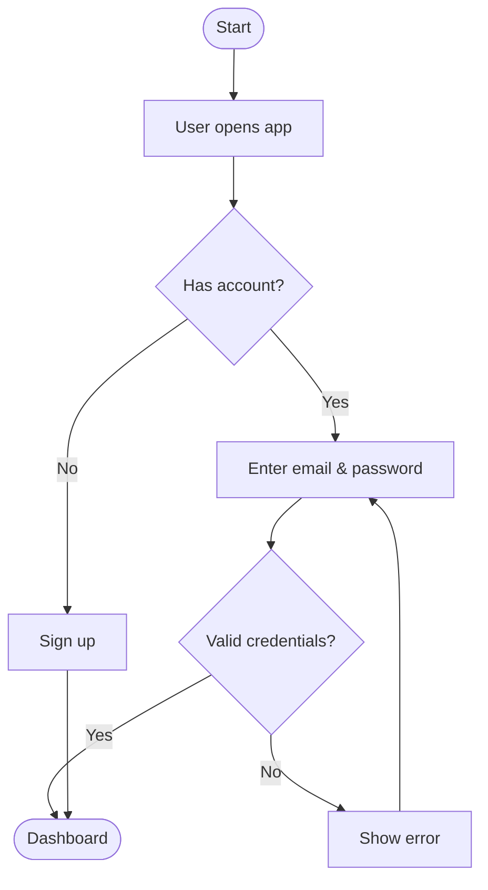

# Workshop 2: Creating Diagrams with GitHub Copilot

Learn how to use GitHub Copilot to generate professional diagrams using [Mermaid](https://mermaid.js.org/) — a text-based diagramming tool built into GitHub, VS Code, and many documentation platforms.

## 🎯 Learning Objectives

By the end of this workshop, you will be able to:

- Use GitHub Copilot to generate Mermaid diagrams from natural language descriptions
- Create flowcharts, sequence diagrams, entity-relationship diagrams, and more
- Embed diagrams in Markdown files and Slidev presentations
- Iterate on diagrams using Copilot Chat

## 🛠️ Prerequisites

- [VS Code](https://code.visualstudio.com/) with the [GitHub Copilot extension](https://marketplace.visualstudio.com/items?itemName=GitHub.copilot)
- The [Markdown Preview Mermaid Support](https://marketplace.visualstudio.com/items?itemName=bierner.markdown-mermaid) VS Code extension (for live preview)
- No coding experience required

## 📋 Workshop Exercises

### Exercise 1: Generate a Flowchart

1. Open a new file called `diagrams.md`.
2. Add the following comment and ask Copilot to complete it:

```markdown
<!-- Flowchart showing a user login process -->
```

Expected output from Copilot (example):



3. Preview in VS Code by opening the Markdown preview panel (`Ctrl+Shift+V`).

---

### Exercise 2: Design a Sequence Diagram

Ask Copilot Chat:

> "Create a Mermaid sequence diagram showing how a web browser interacts with an API server and a database when a user submits a login form."

Add the output to `diagrams.md` and verify the preview.

---

### Exercise 3: Create an Entity-Relationship Diagram

1. Describe your data model in a comment:

```markdown
<!-- ER diagram for a blog: users, posts, comments, and tags -->
```

2. Let Copilot generate the diagram, then ask Copilot Chat to refine it:
   > "Add a `likes` table that allows users to like both posts and comments."

---

### Exercise 4: Draw a System Architecture Diagram

Ask Copilot Chat:

> "Create a Mermaid diagram showing a microservices architecture with an API gateway, user service, product service, order service, and a shared database per service."

---

### Exercise 5: Embed a Diagram in a Presentation

1. Copy your best diagram from `diagrams.md`.
2. Open `slides.md` in the repository root.
3. Add a new slide and paste the diagram inside a `mermaid` fenced code block.
4. Run `npm run dev` to see the diagram rendered in the presentation.

## 💡 Copilot Tips for Diagrams

| Goal | Copilot Prompt |
|------|---------------|
| Flowchart | "Create a Mermaid flowchart showing [process]" |
| Sequence diagram | "Draw a sequence diagram for [interaction]" |
| ER diagram | "Generate an ER diagram for a [domain] database" |
| Class diagram | "Create a UML class diagram for [system]" |
| Gantt chart | "Make a Mermaid Gantt chart for a 4-week project with [tasks]" |
| Improve layout | "Reorganize this Mermaid diagram to reduce edge crossings" |
| Add styling | "Add colors to the nodes: green for success, red for error" |

## 🗂️ Supported Mermaid Diagram Types

- `flowchart` — Process flows and decision trees
- `sequenceDiagram` — Interactions between actors over time
- `erDiagram` — Database entity-relationship diagrams
- `classDiagram` — UML class relationships
- `stateDiagram-v2` — State machines
- `gantt` — Project timelines
- `pie` — Proportional data
- `mindmap` — Hierarchical idea mapping
- `gitGraph` — Git branching history

## 📚 Resources

- [Mermaid Live Editor](https://mermaid.live/) — Preview diagrams in the browser
- [Mermaid Documentation](https://mermaid.js.org/intro/)
- [Mermaid in GitHub Markdown](https://github.blog/2022-02-14-include-diagrams-markdown-files-mermaid/)
- [GitHub Copilot Documentation](https://docs.github.com/en/copilot)
